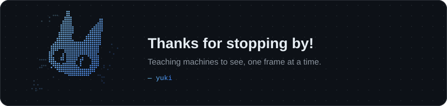

<picture>
  <source media="(prefers-color-scheme: dark)" srcset="assets/hero-dark.svg">
  <source media="(prefers-color-scheme: light)" srcset="assets/hero-light.svg">
  
</picture>

## About Me

I'm **Yuki**, also known as **Yukine**, a final-year Computer Engineering student who likes teaching computers to make sense of what they see.

Right now I'm building **[ArangCada](https://github.com/10yukine/ArangCada)**, a tricycle booking and dispatch app for Calamba City, Philippines.

```python
class Yukine:
    name      = "Yuki"
    role      = "Final-year Computer Engineering Student"
    into      = ["Artificial Intelligence", "Computer Vision"]
    building  = "ArangCada"
    exploring = "practical applications of machine learning"
```

## Tech Stack

**Certified**

<p>
  
  
  
  
  
</p>

**Built with on [ArangCada](https://github.com/10yukine/ArangCada)**

<p>
  
  
  
  
  
  
  
</p>

## Training & Certificates

<table>
  <tr>
    <th align="left">AI &amp; Machine Learning</th>
    <th align="left">Systems &amp; Networks</th>
  </tr>
  <tr>
    <td valign="top">
      <ul>
        <li>OpenCV · PyTorch · TensorFlow</li>
        <li>Claude Academy: Claude Code 101 (Anthropic, 2026)</li>
        <li>Microsoft Artificial Intelligence &amp; Cybersecurity courses</li>
      </ul>
    </td>
    <td valign="top">
      <ul>
        <li>Installing and Configuring Computer Systems</li>
        <li>Introduction to Computer Systems Servicing</li>
        <li>Maintaining Computer Systems and Networks</li>
        <li>Setting Up Computer Networks</li>
        <li>Setting Up Computer Servers</li>
      </ul>
    </td>
  </tr>
</table>

<br>

<picture>
  <source media="(prefers-color-scheme: dark)" srcset="assets/footer-dark.svg">
  <source media="(prefers-color-scheme: light)" srcset="assets/footer-light.svg">
  
</picture>

<!-- The banners are generated from the braille art in assets/art: python3 scripts/build_svgs.py -->
